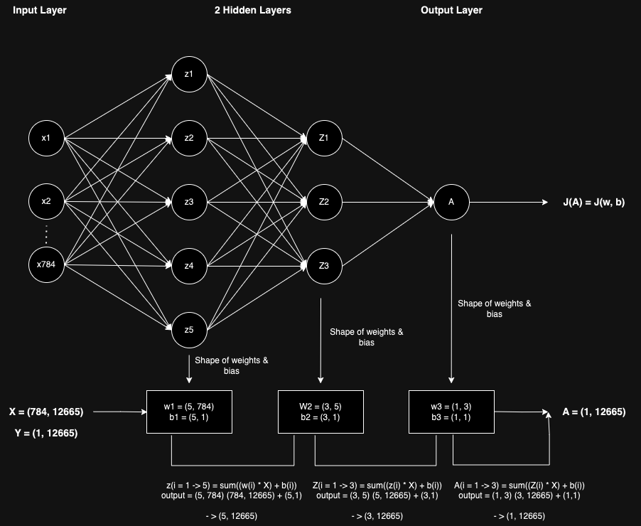

# Project: Building a Binary Image Classifier from Scratch using NumPy

## Inroduction
Supervised learning is a type of machine learning where the model learns from labeled data, meaning it is provided with input-output pairs during training. The goal of supervised learning is to learn a mapping from inputs to outputs, so that given new, unseen inputs, the model can accurately predict the corresponding outputs. Supervised learning can be divided into two main categories: classification and regression. For this project we will focus on classification.

- Classification: Classification is a type of supervised learning task where the goal is to predict the category or class label of a given input based on its features. In classification, the output variable is categorical, meaning it takes on discrete values from a predefined set of classes. For example, recognizing handwritten digits as numbers from 0 to 9.

## Data Description
This project utilizes the following datasets stored in the `data` directory:

- [`Binary_Train.npz`](data/Binary_Train.npz): Dataset containing training data for binary image classification.
- [`Binary_Dev.npz`](data/Binary_Dev.npz): Dataset containing development (validation) data for binary image classification.
- [`MNIST.npz`](data/MNIST.npz): Dataset containing handwritten digit images for multiclass image classification.

## Single Neuron Training (Project 0 - 7)
This project focuses on training a single neuron for binary image classification. The `Neuron` class is implemented to perform forward propagation, cost calculation, gradient descent, and training using a specified number of iterations and learning rate.

### Training Results
The training process includes monitoring the cost function over iterations and plotting the training cost graphically. Below are the visualizations generated during training and some key stats.

- Train cost: 0.013386353289868338
- Train accuracy: 99.66837741808132%
- Dev cost: 0.010803484515167203
- Dev accuracy: 99.81087470449172%

#### Training Cost

#### Predicted Output

## Single Hidden Layer Neural Network (Project 8 - 15)

## Overview
This project revolves around implementing a single hidden layer neural network for binary image classification. The neural network architecture comprises an input layer, a hidden layer with configurable nodes, and an output layer with a single neuron. The model's objective is to classify images into one of two classes: positive or negative.

### Class: NeuralNetwork
The `NeuralNetwork` class is responsible for initializing and training the neural network. Below is a breakdown of its methods and attributes:

### Methods:
1. `__init__(nx, nodes)`: Constructor method to initialize the neural network with the specified number of input nodes (`nx`) and hidden layer nodes (`nodes`).
   
2. `forward_prop(X)`: Performs forward propagation through the neural network to compute the output of the hidden layer (`A1`) and the output layer (`A2`).

3. `cost(Y, A)`: Calculates the cost (or loss) of the neural network based on the predicted output (`A`) and the actual labels (`Y`).

4. `evaluate(X, Y)`: Evaluates the performance of the neural network by computing predictions for input data `X` and comparing them against the actual labels `Y`. Returns the predictions and the corresponding cost.

5. `gradient_descent(X, Y, A1, A2, alpha=0.05)`: Performs one pass of gradient descent to update the weights and biases of the neural network based on the computed gradients.

6. `train(X, Y, iterations=5000, alpha=0.05, verbose=True, graph=True, step=100)`: Trains the neural network using the specified number of iterations and learning rate (`alpha`). It prints the cost at regular intervals if `verbose=True` and plots the training cost if `graph=True`.

### Attributes:
1. `W1`, `b1`: Weight matrix and bias vector for the hidden layer.
2. `W2`, `b2`: Weight matrix and bias scalar for the output layer.
3. `A1`, `A2`: Output activations of the hidden layer and the output layer, respectively.

### Image Data
The image data used for training and evaluation is stored in numpy arrays. The shape of the image data is `(784, 12665)`, where each column represents a flattened image of size 784 pixels. The corresponding labels are binary, with a shape of `(1, 12665)`.

### Training
The training process involves iteratively updating the neural network's parameters (weights and biases) using gradient descent. The cost function is minimized over the specified number of iterations to improve the model's classification accuracy.

### Key Stats
- Train cost: 0.024369225667283875
- Train accuracy: 99.3999210422424%
- Dev cost: 0.020330639788072764
- Dev accuracy: 99.57446808510639%

## Deep Neural Network for Binary Classification (Project 16 - 23)

This project implements a Deep Neural Network (DNN) for binary classification. The network architecture consists of an input layer, multiple hidden layers, and an output layer. The DNN is trained using gradient descent with backpropagation.

### Code
-> [`Deep Neural Network`](23-deep_neural_network.py)

### Key Stats
- Train cost: 0.011671820326008166
- Train accuracy: 99.88945913936044%
- Dev cost: 0.009249552132279246
- Dev accuracy: 99.95271867612293%