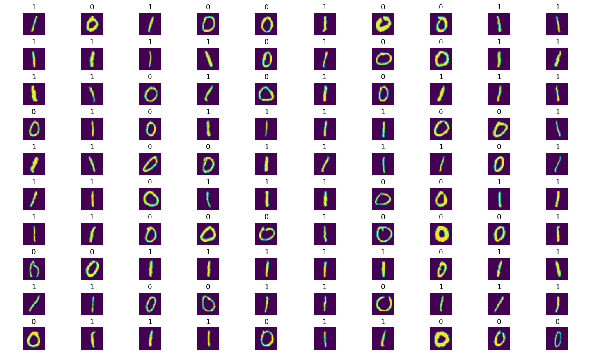

# Project: Building a Binary Image Classifier from Scratch using NumPy
## Learning Objectives
At the end of this project, you'll be proficient in:

- Understanding the concept of a model and its role in machine learning.
- Grasping the fundamentals of supervised learning and its significance in training models.
- Defining prediction and its application in making estimations based on trained models.
- Recognizing nodes as the basic computational units in neural networks.
- Understanding the significance of weights and biases in adjusting model behavior.
- Explaining activation functions and their role in introducing non-linearity into neural networks.
- Understanding and implementing Sigmoid, Tanh, ReLU, and Softmax activation functions.
- Understanding the concept of layers in neural networks and their role in hierarchical feature learning.
- Identifying hidden layers as layers within a neural network that are neither input nor output layers.
- Understanding Logistic Regression as a linear classifier used for binary classification tasks.
- Defining loss and cost functions and understanding their role in evaluating model performance.
- Understanding forward propagation as the process of predicting outputs given inputs in a neural network.
- Understanding Gradient Descent as an optimization algorithm used for minimizing loss functions.
- Understanding backpropagation as the process of computing gradients of the loss function with respect to weights and biases.
- Understanding Computation Graphs as a visual representation of mathematical operations in neural networks.
- Understanding the importance of initializing weights and biases appropriately in neural networks.
- Understanding the importance of vectorization in efficiently processing large datasets.
- Understanding how to split data into training, validation, and test sets for model evaluation.
- Understanding multiclass classification and its differences from binary classification.
- Understanding one-hot encoding as a technique used to represent categorical variables.
- Understanding softmax function and its application in multiclass classification tasks.
- Understanding cross-entropy loss as a loss function commonly used in classification tasks.
- Understanding pickling in Python and its role in serializing and deserializing objects.

## Single Neuron Training (Project 0 - 7)
This project focuses on training a single neuron for binary image classification. The `Neuron` class is implemented to perform forward propagation, cost calculation, gradient descent, and training using a specified number of iterations and learning rate.

### Training Results
The training process includes monitoring the cost function over iterations and plotting the training cost graphically. Below are the visualizations generated during training and some key stats.

- Train cost: 0.013386353289868338
- Train accuracy: 99.66837741808132%
- Dev cost: 0.010803484515167203
- Dev accuracy: 99.81087470449172%

#### Training Cost

#### Predicted Output
